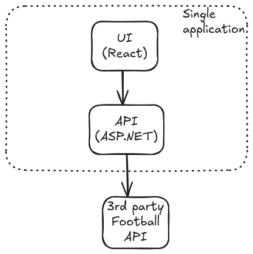

# sports-explorer

## Status

[](https://github.com/savbace/sports-explorer/actions/workflows/azure-webapps-dotnet-core.yml)

## Overview

Simple **educational** application that enables a user to select any team in the 2024/25 season of the [English Premier League](https://www.premierleague.com/) and return the squad details for that chosen team.

If you're lucky you'll find the application available from the internet [here](ap-sports-ex-aeb0fxdxbrctdgch.eastus-01.azurewebsites.net).

## How to start locally

1. Make sure `~/.aspnet/https` directory exists before start (Linux only). This ensures HTTPS dev certs will be created successfuly.
2. Install NPM packages: 
```bash
cd sportsexplorer.client/
npm i
```
1. Build ASP.NET server and start the app. Note: React application should start automatically with the server.
```bash
cd ../SportsExplorer.Server/
dotnet build
dotnet run -lp https
```
1. Go to https://localhost:5173/ in your favourite web browser.

## Tech parts

### General view


### Components overview

#### Server
- ASP.NET Web API application based on minimal APIs.
- React UI application is started automatically with the server.
- [Refit](https://github.com/reactiveui/refit) is used to call 3rd-party footbal HTTP API and get a data about teams and players.

#### UI
- React application bootstraped with [Vite](https://vite.dev/).
- Components library: [Material UI](https://mui.com/material-ui/).
- Data fetching made with [SWR](https://swr.vercel.app/).
- UI assets are hosted as [static files](https://learn.microsoft.com/en-us/dotnet/api/microsoft.aspnetcore.builder.staticfilesendpointroutebuilderextensions.mapfallbacktofile?view=aspnetcore-9.0) in the Server application.

#### 3rd-party football API
The internal API of the Premier League website [page](https://www.premierleague.com/players) is used as a data source of teams and squads.

**DISCLAIMER** :warning: Usage of this API can be unstable from the contract change, performance, legal or other points of view and is intented for **educational** purposes only. 


## Potential ideas for the future
1. Cache response of the 3rd-party API in order to minimize number of calls to it.
2. Fetch data automatically from the 3rd-party API and store them in a dedicated database. Use this database as data source for the app. Create a cron job to synchronize data from the API to the database.
3. Deploy UI part separately e.g. to [Azure Static App](https://azure.microsoft.com/en-us/products/app-service/static). 


## References
- [Create an ASP.NET Core app with React in Visual Studio](https://learn.microsoft.com/en-us/visualstudio/javascript/tutorial-asp-net-core-with-react?view=vs-2022).
- [Microsoft.AspNetCore.SpaProxy](https://www.nuget.org/packages/microsoft.aspnetcore.spaproxy) 
- [Refit in .NET: Building Robust API Clients in C#](https://www.milanjovanovic.tech/blog/refit-in-dotnet-building-robust-api-clients-in-csharp).

